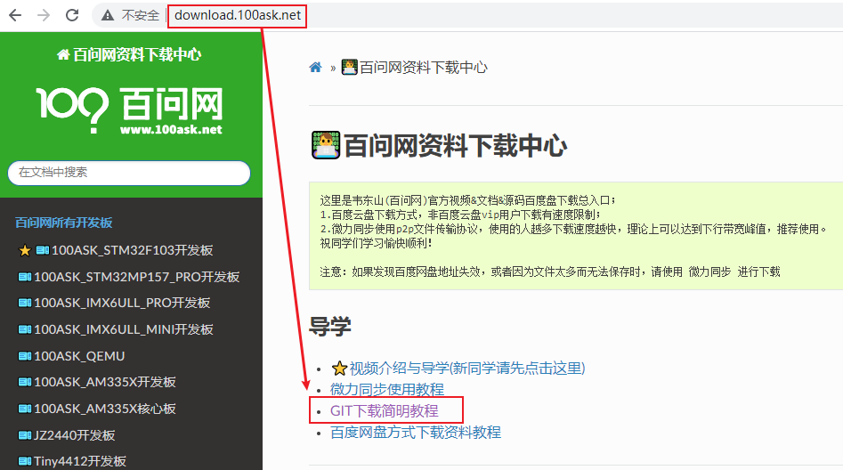
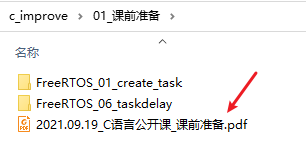
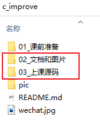
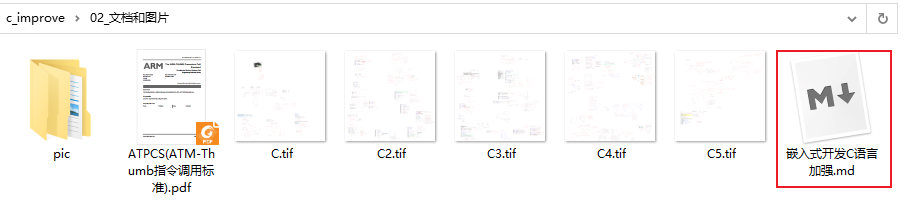

# C语言加强
## 1. 课程介绍

### 1.1 内容

C语言是RTOS课程的基础，

我们日常工作中掌握的C语言，深度不足。

我们将在20210919周日，开启全天直播，现场编程，互动教学，加强C语言。

主题如下：

* 变量与指针
* 链表操作
* ARM架构简述
* 几条汇编指令
* 结合汇编掌握：全局变量、局部变量、变量赋值、地址操作、栈等深层次的知识

直播现场，先讲理论，在进行编程实验。


### 1.2 特色

使用2个口诀，**推导**C语言的难点：指针、链表等等。

使用2个口诀，深入理解C语言，永远不会忘！


## 2. 学习步骤

### 2.1 下载GIT仓库

本教程所有资料放在如下GIT仓库里：
```shell
git clone https://e.coding.net/weidongshan/rtos_training/c_improve.git
```


如果你不会使用GIT，请参考如下链接：




### 2.2 安装Keil

下载到GIT仓库后，安装如下文档安装开发环境：




### 2.3 观看视频、学习源码

在视频中，编写的"文档和图片"、源码，都放在GIT仓库中：



在如下文件中，有视频和源码的对照表：




## 3. 观看视频

* 官网：http://www.100ask.net

* 手机：微信、QQ、浏览器，打开http://www.100ask.net

* 微信小程序：搜“韦东山”

* B站：搜"韦东山"


## 4. 联系方式

* 官网：http://www.100ask.net

* 淘宝：http://100ask.taobao.com

* 微信小程序：搜“韦东山”

* 公众号：
  

  